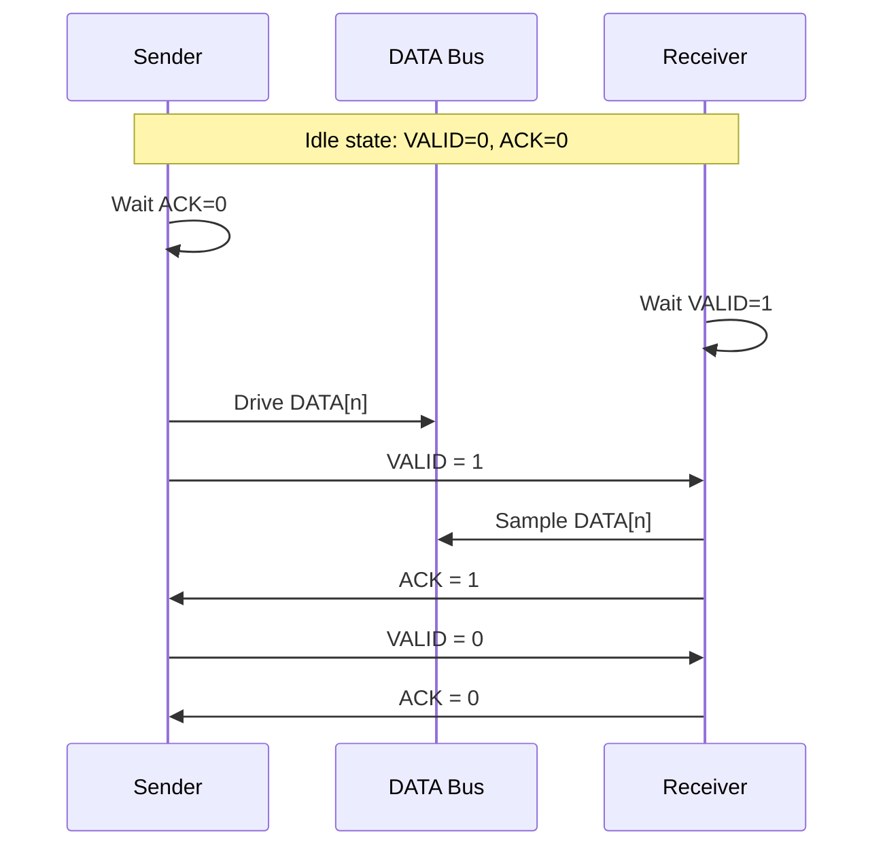
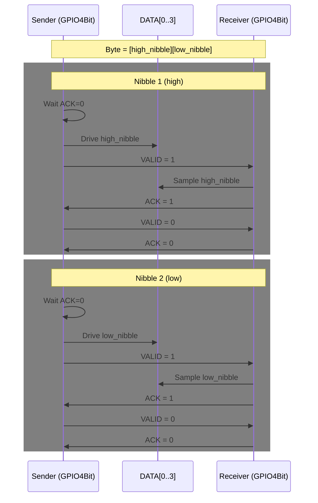

# GPIO Protocol (SLAPI)

This document explains how the GPIO transport works so a developer can implement a compatible interface on another device.

## Overview

The GPIO transport is a parallel data bus with a 2-wire handshake:

- `VALID` (driven by sender)
- `ACK` (driven by receiver)

Data is transferred either as:

- **8-bit mode** (`GPIO8Bit`): one handshake per byte
- **4-bit mode** (`GPIO4Bit`): two handshakes per byte (high nibble first, then low nibble)

Bit order on pins is little-endian by index:

- `data_pins[0]` = bit 0
- `data_pins[1]` = bit 1
- ...

## Signal Roles

At any point in time:

- Sender places data on `DATA[n]` and toggles `VALID`
- Receiver watches `VALID`, samples `DATA[n]`, and toggles `ACK`

Handshake is active-high for both `VALID` and `ACK`.

## Core Handshake

### Sender sequence

1. Drive data onto `DATA[n]`
2. Set `VALID = 1`
3. Wait for `ACK = 1`
4. Set `VALID = 0`
5. Wait for `ACK = 0`

### Receiver sequence

1. Set `ACK = 0`
2. Wait for `VALID = 1`
3. Sample `DATA[n]`
4. Set `ACK = 1`
5. Wait for a short while for level detecttion by other party
6. Set `ACK = 0`

This gives a deterministic ready/accept cycle and avoids races when both peers follow the same order.

## Sequence Diagrams

### Single Transfer Handshake (generic)



### 4-bit Mode Byte Transfer (high nibble, then low nibble)



## 8-bit Mode (`GPIO8Bit`)

### Write (`_write_byte`)

- Configure data pins as outputs
- Set all 8 bits on `DATA[0..7]`
- `VALID` high
- Wait `ACK` high
- `VALID` low
- Wait `ACK` low

### Read (`_read_byte`)

- Configure data pins as inputs
- Wait `VALID` high
- Sample 8 data pins into one byte
- `ACK` high
- Wait `VALID` low
- `ACK` low

## 4-bit Mode (`GPIO4Bit`)

Each byte is split into two nibbles:

- High nibble first: `(byte >> 4) & 0x0F`
- Low nibble second: `byte & 0x0F`

### Write (`_write_nibble`)

- Configure data pins as outputs
- Wait `ACK` low
- Drive 4-bit nibble on `DATA[0..3]`
- `VALID` high
- Wait `ACK` high
- `VALID` low
- Hold low for `MIN_HOLD_TIME_MS`

### Read (`_read_nibble`)

- Configure data pins as inputs
- **Resync step:** wait for `VALID` low before starting next sample
- Wait `VALID` high
- Sample nibble
- `ACK` high, hold for `MIN_HOLD_TIME_MS`
- Wait `VALID` low
- `ACK` low, hold for `MIN_HOLD_TIME_MS`

The resync step helps recover cleanly between nibbles and reduces framing drift.

## Timing and Robustness

- `TIMEOUT_MS`
	- Applied while waiting for `VALID` or `ACK` to reach expected state
	- `0` means wait forever (no timeout)
- `MIN_HOLD_TIME_MS`
	- Enforces minimum pulse/level hold after transitions in 4-bit mode
	- Helps slower clients reliably detect levels

If timeout is reached, the code raises `RuntimeError`.

## API Behavior

- `write(data)` accepts `bytes` or `str` (string is encoded), then sends byte-by-byte
- `read(size)` attempts to read `size` bytes, stopping early if a byte read returns `None`
- `set_write_mode()` / `set_read_mode()` switch GPIO direction explicitly

## Electrical / Integration Notes

- Inputs are configured with pull-ups (`Pin.PULL_UP`) in this implementation
- Keep both peers consistent on:
  - Mode (`4bit` or `8bit`)
  - Data pin mapping and bit order
  - Handshake polarity (`VALID`/`ACK` active-high)
  - Timing (`TIMEOUT_MS`, `MIN_HOLD_TIME_MS`)

## Implementation Checklist

To interface successfully from another MCU/host:

1. Match pin wiring and bit ordering exactly
2. Implement the same sender/receiver state machine
3. Honor nibble order in 4-bit mode (high, then low)
4. Respond to handshake edges before timeout
5. Add short hold/delay handling for slow GPIO polling loops

## Minimal State Machine Pseudocode

### Sender (single transfer)

```
wait until ACK == 0
drive DATA
VALID = 1
wait until ACK == 1
VALID = 0
```

### Receiver (single transfer)

```
wait until VALID == 1
sample DATA
ACK = 1
wait until VALID == 0
ACK = 0
```

